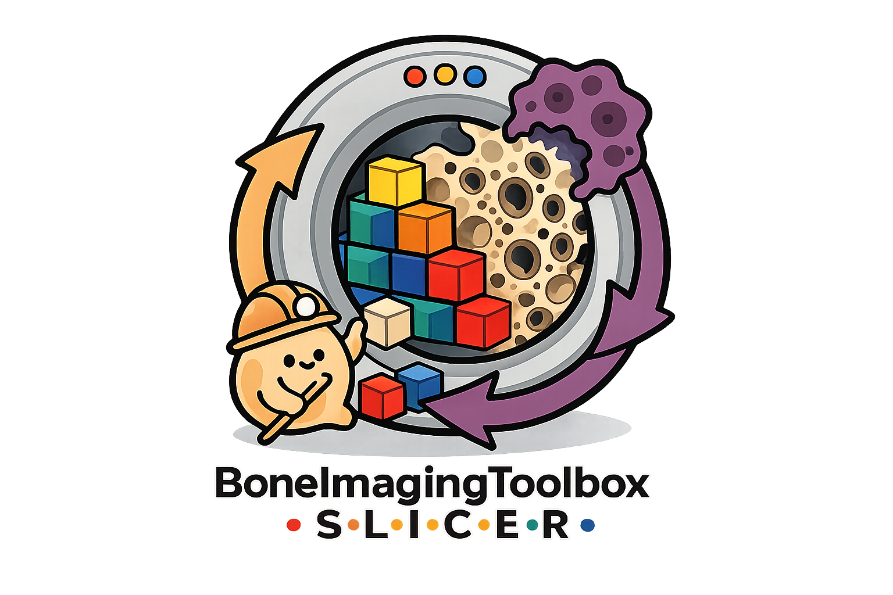

<p align="center">
  
</p>

# Bone Imaging Toolbox

Bone Imaging Toolbox is a 3D Slicer extension for bone-imaging workflows. It provides Slicer interfaces for Scanco image import/export, dataset normalization, batch processing, contouring, longitudinal remodelling, microarchitecture, plate/rod morphometry, finite element analysis, mechanoregulation, motion grading, and CT spine segmentation.

The Slicer extension is the user-facing layer. Reusable scientific logic lives in focused Python packages such as `bone-contouring`, `timelapsed-hrpqct`, `bone-microarchitecture`, `plate-rod-thinning`, `parosol-py`, and `bone-mechanoregulation`.

## Slicer Modules

```text
Bone Imaging
  Setup
    Toolbox Setup
  I/O
    Scanco I/O
    Dataset Naming Helper
    Batch Processor
  Microstructural Analysis
    Motion Scoring
    Contouring
    Mask and Label Algebra
    Timelapsed Remodelling
    Mechanoregulation
    Microarchitecture
    Plate/Rod Morphometry
  FE Analysis
    ParOsol-FEA
  CT Analysis
    Spine Segmentation
```

## Where To Start

- Install the extension and runtime packages from [Installation](installation.md).
- Follow the recommended processing order in [Workflow Overview](workflow-overview.md).
- Normalize cohort data with the [Dataset Naming Helper](tools/dataset-naming-helper.md).
- Run cohort workflows through the [Batch Processor](tools/batch-processor.md).
- Use scene workflows when working with loaded Slicer nodes interactively.
- Use the [Derivative Workflow Contract](derivatives.md) when connecting outputs across tools.
- Check [Troubleshooting](troubleshooting.md) when modules, masks, batch rows, or docs builds behave unexpectedly.

## Citation

Use the citation that matches the workflow and results you report. See each tool page for focused citation guidance.

- Timelapsed remodelling and mechanoregulation: Walle M et al. *Bone*. 2023;172:116780. doi: [10.1016/j.bone.2023.116780](https://doi.org/10.1016/j.bone.2023.116780).
- Multistack registration: Whittier DE et al. *Bone*. 2023;176:116893. doi: [10.1016/j.bone.2023.116893](https://doi.org/10.1016/j.bone.2023.116893).
- Motion grading: Walle M et al. *Bone*. 2023;166:116607. doi: [10.1016/j.bone.2022.116607](https://doi.org/10.1016/j.bone.2022.116607).
- Plate/rod network morphometry: Walle M et al. *Front Bioeng Biotechnol*. 2024;12:1384280. doi: [10.3389/fbioe.2024.1384280](https://doi.org/10.3389/fbioe.2024.1384280).
- Spine vertebral localization: Payer C et al. VISAPP 2020. doi: [10.5220/0008975201240133](https://doi.org/10.5220/0008975201240133).
- Spine compartment workflow: Walle M and Matheson BE et al. *GigaScience*. 2025;14:giaf094. doi: [10.1093/gigascience/giaf094](https://doi.org/10.1093/gigascience/giaf094).

## Authorship

The Bone Imaging Toolbox Slicer modules were developed by Matthias Walle. Core packages and third-party methods may have their own authorship, license, and citation requirements.
